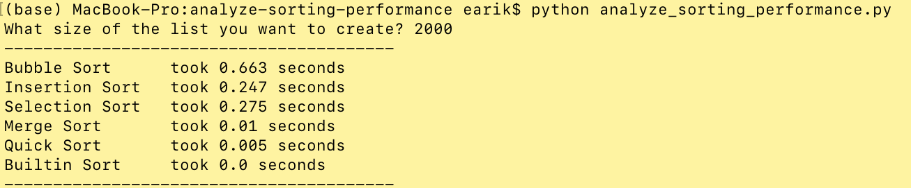

# analyze-sorting-performance
Python script calculates required time to run following sorting algorithms; bubble sort, insertion sort, selection sort, merge sort, quick sort and built-in python sort.

### Requirements
Python 3.

### Usage
After downloading (or cloning the script), run python code in your terminal. 

`python analyze_sorting_performance.py`

It generates a list of random numbers to be sorted. For this, a certain list size needs to be given as an input.

An example of script execution and performance results;

